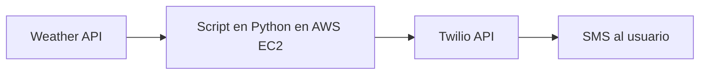

# 🌤️ Notificador SMS del tiempo

Automatización de alertas meteorológicas vía SMS utilizando **Twilio**, **Weather API**, **AWS EC2** y **Python**.  
El sistema obtiene el pronóstico del clima de una ciudad determinada y lo envía automáticamente a un número de celular en un horario programado.

---

## 🚀 Tecnologías utilizadas
- **Python** → automatización y lógica del sistema.  
- **Weather API** → obtención de datos meteorológicos en formato JSON.  
- **Twilio** → compra de número y envío de SMS.  
- **AWS EC2** → ejecución del script en la nube con tareas programadas (cron).  

---

## 📂 Estructura del proyecto
├── docs/ # Documentación, diagramas, imágenes  
├── src/ # Código fuente  
│ └── programa_principal.py  
│ └── twilio_config.py  
├── .gitignore  
├── requerimientos.txt # Dependencias de Python  
├── README.md # Este archivo

---

## 📊 Arquitectura del sistema

---

## ⚙️ Instalación y uso

- **Clonar el repositorio:**

git clone https://github.com/ml-celiz/Data-Engineer.git
cd Data-Engineer

- **Instalar dependencias:**

pip install -r requimientos.txt

- **Configurar variables de entorno:**

1. Crear cuenta en Twilio para obtener:

TWILIO_SID  
TWILIO_TOKEN  

2. Crear cuenta en Weather API para obtener:

WEATHER_API_KEY  

3. Definir variables de entorno:

export TWILIO_SID="tu_sid"  
export TWILIO_TOKEN="tu_token"  
export WEATHER_API_KEY="tu_api_key"  
export PHONE_NUMBER="+549XXXXXXXXX"  

- **Ejecutar el script manualmente:**

python src/programa_principal.py
